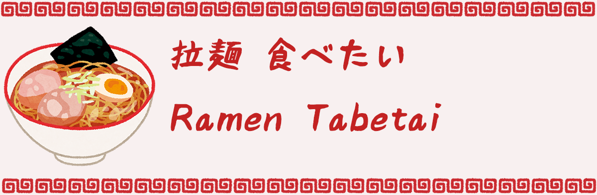
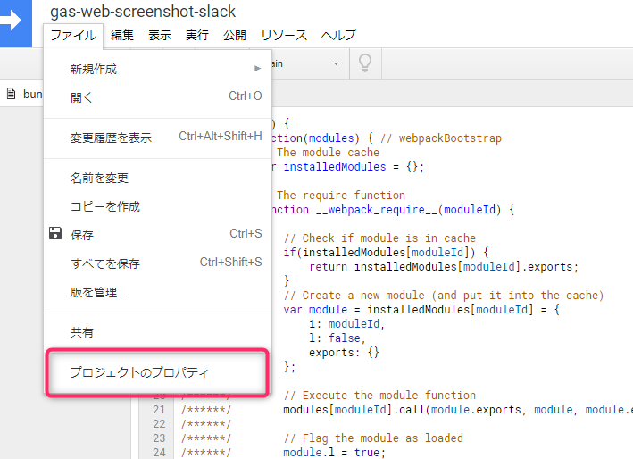
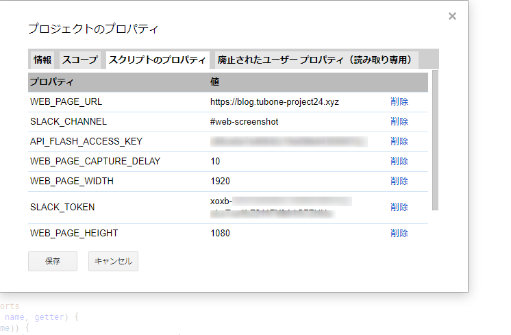
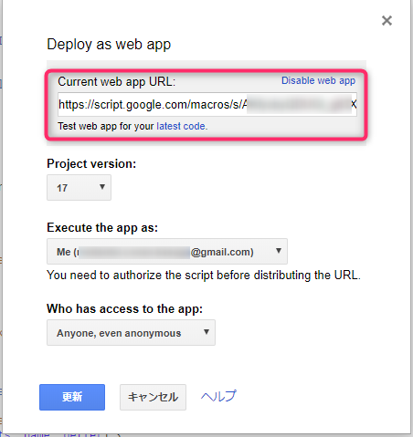
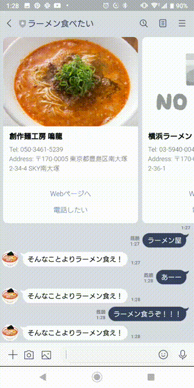
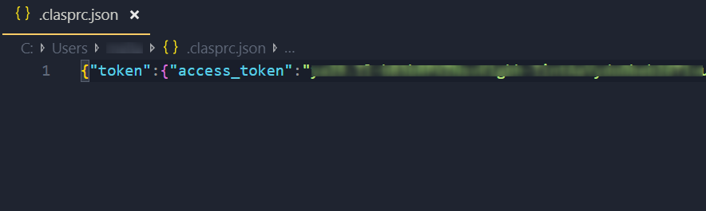
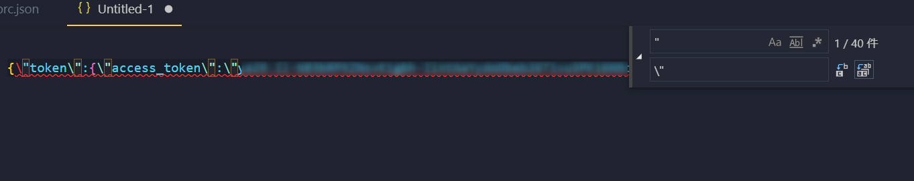
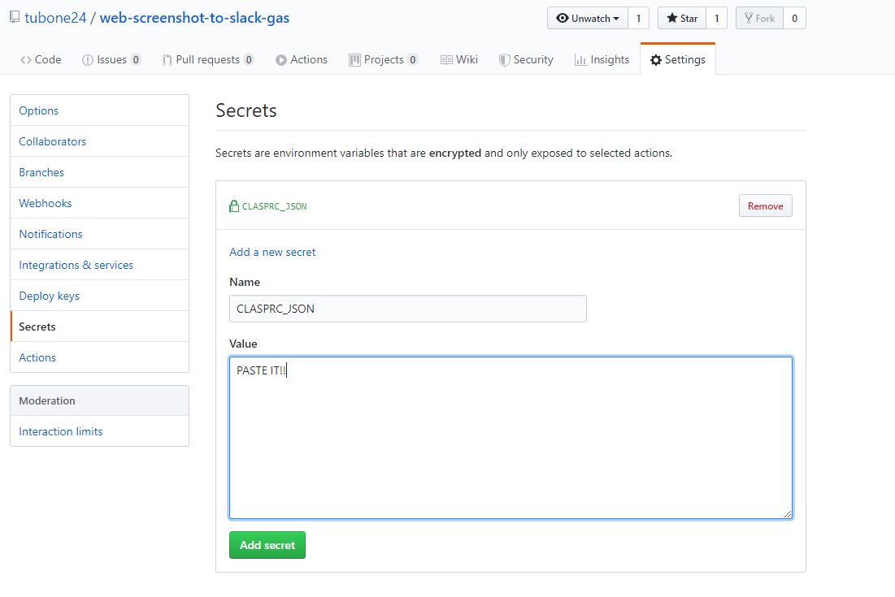

# Ramen Tabetai (I want to have a Ramen)



[](https://github.com/google/clasp)
[](LICENSE)
[](https://github.com/RichardLitt/standard-readme)
[](http://makeapullrequest.com)

> Do you like ramen?

## Table of Contents

- [Background](#background)
- [Install](#install)
- [Usage](#usage)
- [Demos](#demos)
- [Test](#Test)
- [Contributing](#contributing)
- [License](#license)

## Background

Do you like a Ramen?

I Like a Ramen very much.

Do you want to check Ramen shop near by you easily if you going out?

This `LINEBOT` is the solution that you check Ramen shop. 

## Install

### Precondition

- [Node.js (more v10.15.x)](https://nodejs.org/en/)
- [google/clasp](https://github.com/google/clasp)
  - `npm install @google/clasp -g`
- Google Account
- Slack Admin Account
- conoHa Admin Account

### Create LINEBOT and Messaging API

Check this link.

<https://developers.line.biz/ja/docs/messaging-api/building-bot/>

### Create GruNavi API

<https://ssl.gnavi.co.jp/api/regist/?p=input>

### Set environment variables with Script Properties

Set some variables with Script Properties





Set variables below. 

```ini
LINE_BEARER=line bearer
GRUNAVI_TOKEN=grunavi token
```

### Install dependencies

Use `npm`, install dependencies.

```
npm install
```

## Usage

### Build App

Execute the command below, build script file using with webpack and create script files under `dist` directory.

```
npm run build
```

### Push App

Before push app, you need to change GA user setting which enable API.

[https://script.google.com/home/usersettings](https://script.google.com/home/usersettings)

Push App.

```
clasp login  # only first access
clasp push
```

## Deploy as web app

And also, deploy as web app for the script.

Open your script deployed, click `tool bar => publish => deploy as web app`

And check `Current web app URL`, this is Slack outgoing request URL!



**GitHub Actions also deploying as web apps!**

## Demos

Run `main` function , send Slack your web page screenshot.



## Test

If you modify this codes, run unit test with `jest`.

```
npm test
```

Also, this repo is integrated with GitHub Action.

So, Run CI test, if you write test.

### GitHub Action

This repo use GitHub Action, Run tests, Build scripts and push scripts to GAS triggered by push to master branch.

If you want to upload script with GitHub Action, you will set your `.clasprc.json` on GitHub Action SECRET.

#### How to setup your clasprc.json

Before set your clasprc.json, run clasp login with your local PC.

```
clasp login
```

And you open ~/.clasprc.json with editor.

```
# If you use VSCode
code ~/.clasprc.json
```



Copy it and paste another window, and replace `"` character to `\"` because of reading to one-line string on bash command.



Copy it and paste your GitHub Action Secret (https://github.com/{your_name}/{your_repo}/settings/secrets)

Sectet name is `CLASPRC_JSON` and paste your clasprc.json.



Congratulation! You can deploy to GitHub Action!


## Contributing

See [the contributing file](CONTRIBUTING.md)!

PRs accepted.

Small note: If editing the Readme, please conform to the [standard-readme](https://github.com/RichardLitt/standard-readme) specification.

## License

[MIT © tubone.](LICENSE)
