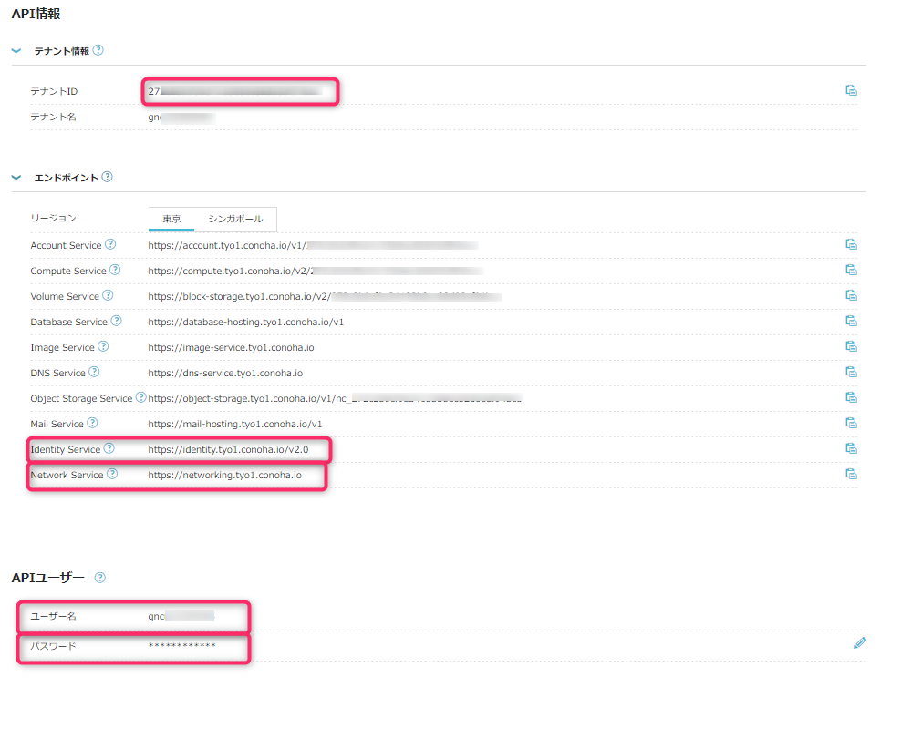
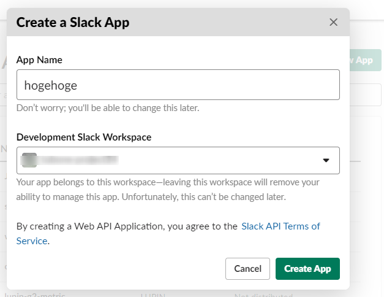
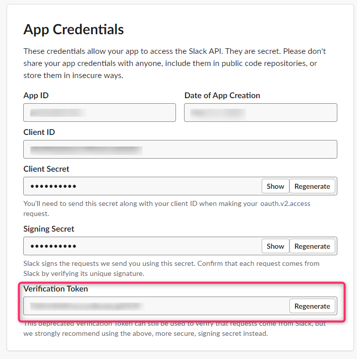
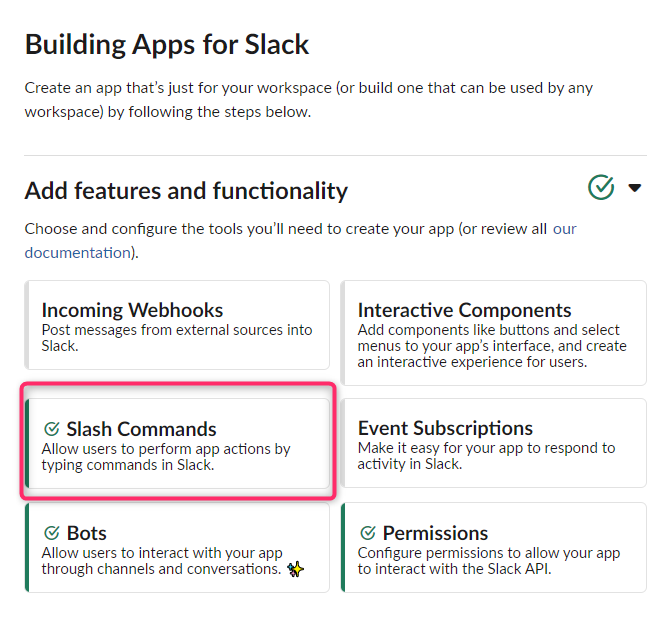
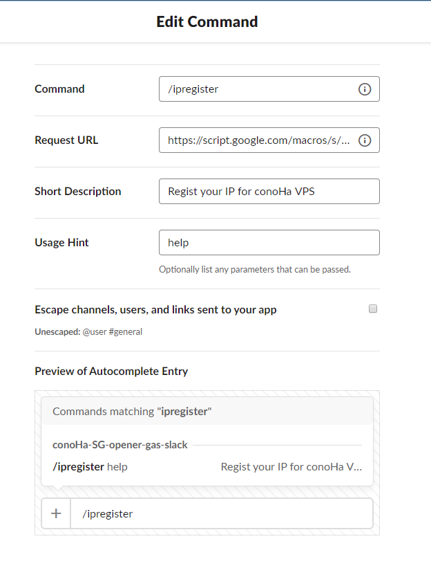
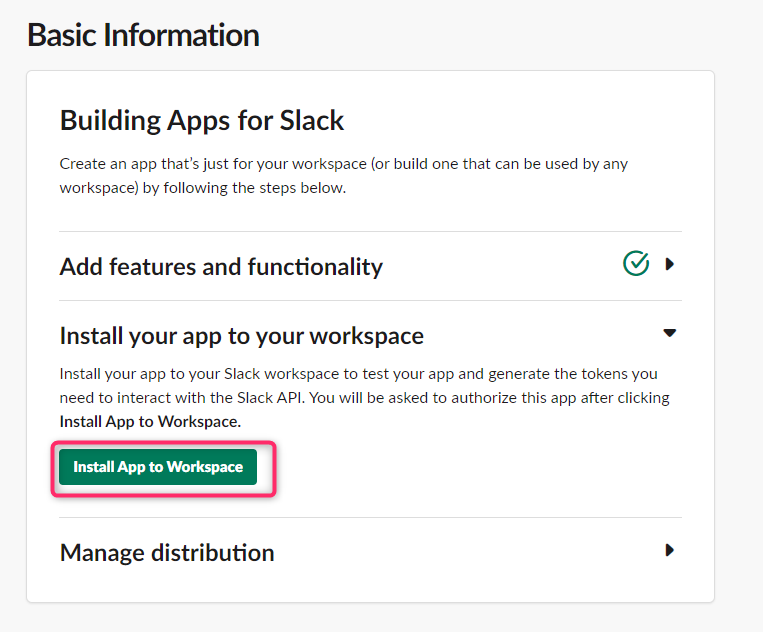
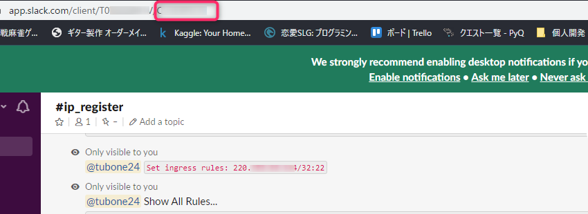
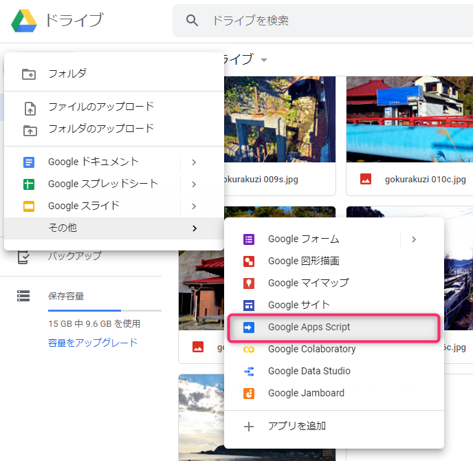
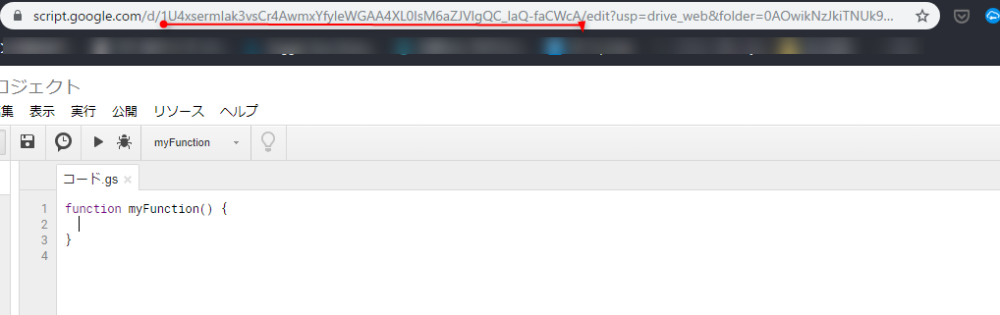

# conoHa SG IP Register for GAS & Slack


[](https://github.com/tubone24/conoha-slack-sg-register-for-gas/actions)
[](https://coveralls.io/github/tubone24/conoha-slack-sg-register-for-gas?branch=master)
[](https://github.com/google/clasp)
[](LICENSE)
[](https://github.com/RichardLitt/standard-readme)
[](http://makeapullrequest.com)

> This is GoogleAppsScript to register home IP address with [conoHa VPS](https://www.conoha.jp/vps/?btn_id=top_vps) SecurityGroup using Slack command.

## Table of Contents

- [Background](#background)
- [Install](#install)
- [Usage](#usage)
- [Demos](#demos)
- [Test](#Test)
- [Contributing](#contributing)
- [License](#license)

## Background

I use [conoHa VPS](https://www.conoha.jp/vps/?btn_id=top_vps) to create my own OpenVPN service and mail service.

For management purposes, there are times when you want to access the server with SSH, but opening the server SSH with any at any time poses a large security risk, so use the [ConoHa API](https://www.conoha.jp/docs/) when you access SSH. Opening the global IP address, and when the use was over, the access was closed again by API.

Because registering and deleting an IP address every time it is accessed from the API is costly, [Slack's Slash command](https://api.slack.com/interactivity/slash-commands) has been used to make it easier to manage OPEN and CLOSE IP addresses in the form of ChatOps.

In addition, the features of using GoogleAppsScript, which can be used for free, and the fact that scripts are described in TypeScript using clasp are also features.

## Install

### Precondition

- [Node.js (more v10.15.x)](https://nodejs.org/en/)
- [google/clasp](https://github.com/google/clasp)
  - `npm install @google/clasp -g`
- Google Account
- Slack Admin Account
- conoHa Admin Account

### Create conoHa target SecurityGroup and attach it on your VPS port

In order to use the conoHa API with this tool, you need to create a SecurityGroup for preparing and managing the API and attach it to your VPS network port in advance.

If you use Postman, use [the postman collection](examples/postman/conoHa.postman_collection.json) and import it.

#### Create API user

First, [create conoHa's API user](https://support.conoha.jp/v/apitokens/) and check the environments in the below.

- TenantId
- username(API)
- password(API)
- Identity Service Domain
- Network Service Domain



#### Create Target SecurityGroup and attach your server's network port

Second, Create new SecurityGroup by [Network API](https://www.conoha.jp/docs/neutron-create_secgroup.php) and attach your server's network port by [Network API](https://www.conoha.jp/docs/neutron-update_port.php).

And check check **SecurityGroup ID**.

If you use Postman, run the request in the below by order.

- Token発行
- セキュリティグループ作成 - Network API v2.0
  - edit request body and change `name` and `description`.
  - check `security_group.id`, this is **Security Group ID**.
- ポート一覧取得 - Network API v2.0
  - check your network port attached your target server.
  - check `ports[].id`, this is **Network port ID**.
  - also check another SecurityGroups because of add to existing config.
- ポート更新 - Network API v2.0
  - edit url for your **Network port ID** like `https://{{networkAPI}}/v2.0/ports/xx213e2dewq-1313-aaaaa`
  - edit request body and add to SecurityGroup existing config.

### Create Slack API

Visit [https://api.slack.com/apps?new_app=1](https://api.slack.com/apps?new_app=1) and Create New app



Next, you add `SlackToken` features because need to `VerifyToken`

Additionally, Check VerifyToken because of using script.



Set slash command in your project.



Request URL is **GAS Endpoint**



And also, change Basic Information with API, install this app to your workspace.



#### Check Slack ChannelID

because of preventing any channel to send command, set channelID.

Channel ID is last path resource in url opening Slack by web browser.



### Create GAS Project

First you create a empty GAS project from Google Drive.



When you create a GAS project, enter name and note `script ID` include the URL. (Red Underline)



Next, enter your `script ID` to `.clasp.json`

```json
{
  "scriptId": "FIXME: This value is your script ID",
  "rootDir": "dist"
}
```

### Set environment variables with Script Properties

Set some variables with Script Properties


Set variables below. 

```ini
VERIFY_TOKEN=slack verify token
CHANNEL_ID=slack channelID
CONOHA_NETWORK_ENDPOINT=Network Service Domain
CONOHA_USERNAME=conoHa username
CONOHA_PASSWORD=conoHa password
CONOHA_IDENTITY_ENDPOINT=Identity Service Domain
CONOHA_TENANTID=conoHa tenantID
CONOHA_TARGET_SG=Security Group ID
```

### Install dependencies

Use `npm`, install dependencies.

```
npm install
```

## Usage

### Build App

Execute the command below, build script file using with webpack and create script files under `dist` directory.

```
npm run build
```

### Push App

Before push app, you need to change GA user setting which enable API.

[https://script.google.com/home/usersettings](https://script.google.com/home/usersettings)

Push App.

```
clasp login  # only first access
clasp push
```

## Deploy as web app

And also, deploy as web app for the script.

Open your script deployed, click `tool bar => publish => deploy as web app`

And check `Current web app URL`, this is Slack outgoing request URL!


**GitHub Actions also deploying as web apps!**

## Demos

Run `main` function , send Slack your web page screenshot.


## Test

If you modify this codes, run unit test with `jest`.

```
npm test
```

Also, this repo is integrated with GitHub Action.

So, Run CI test, if you write test.

### GitHub Action

This repo use GitHub Action, Run tests, Build scripts and push scripts to GAS triggered by push to master branch.

If you want to upload script with GitHub Action, you will set your `.clasprc.json` on GitHub Action SECRET.

#### How to setup your clasprc.json

Before set your clasprc.json, run clasp login with your local PC.

```
clasp login
```

And you open ~/.clasprc.json with editor.

```
# If you use VSCode
code ~/.clasprc.json
```


Copy it and paste another window, and replace `"` character to `\"` because of reading to one-line string on bash command.


Copy it and paste your GitHub Action Secret (https://github.com/{your_name}/{your_repo}/settings/secrets)

Sectet name is `CLASPRC_JSON` and paste your clasprc.json.


Congratulation! You can deploy to GitHub Action!


## Contributing

See [the contributing file](CONTRIBUTING.md)!

PRs accepted.

Small note: If editing the Readme, please conform to the [standard-readme](https://github.com/RichardLitt/standard-readme) specification.

## License

[MIT © tubone.](LICENSE)
